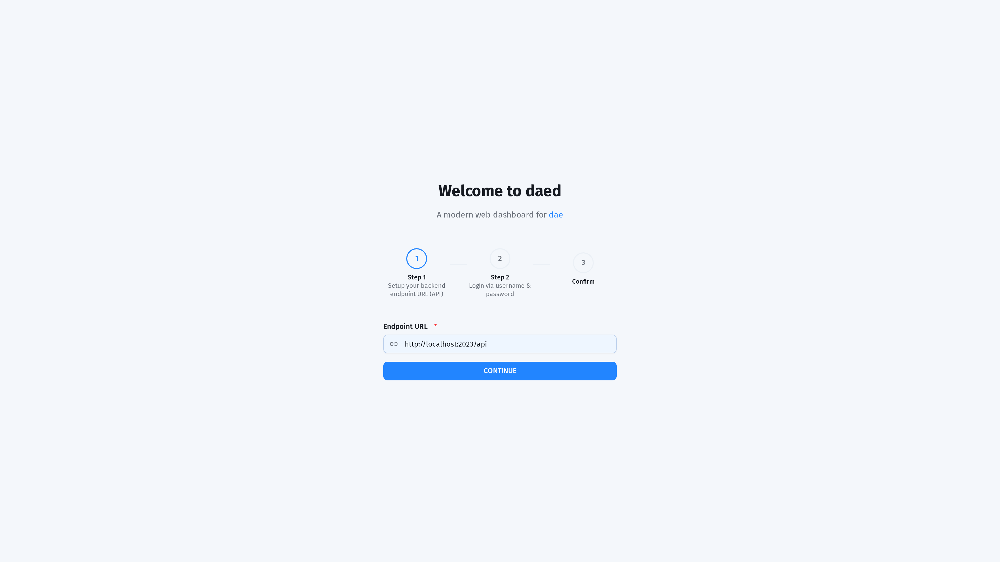
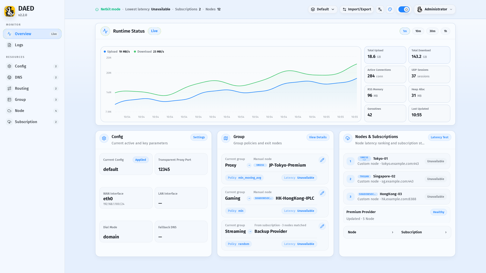
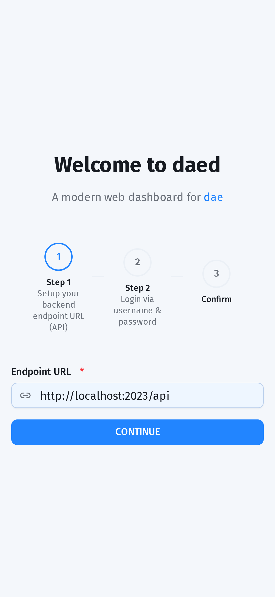
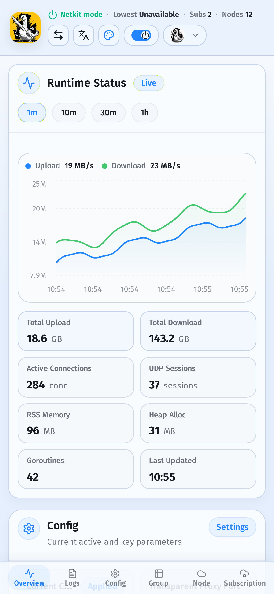

<div align="center">
  
  <h1>daed</h1>
  <p><strong>Product shell and web dashboard for dae</strong></p>

  <p>
    <a href="https://github.com/ksong008/DaedNext/actions/workflows/release-please.yml"></a>
    <a href="https://github.com/ksong008/DaedNext/releases"></a>
    <a href="./LICENSE"></a>
    <a href="https://github.com/ksong008/DaedNext/pulls"></a>
  </p>

  <p>
    <a href="#features">Features</a> |
    <a href="#getting-started">Getting Started</a> |
    <a href="#docker-deployment">Docker</a> |
    <a href="#build-from-source">Build</a> |
    <a href="#development">Development</a> |
    <a href="#license">License</a>
  </p>
</div>

---

## Screenshots

<details open>
<summary><b>Desktop Screenshots</b></summary>

|                                Setup                                |                                   Orchestrate                                   |
| :-----------------------------------------------------------------: | :-----------------------------------------------------------------------------: |
|  |  |

</details>

<details>
<summary><b>Mobile Screenshots</b></summary>

|                                  Setup                                  |                                     Orchestrate                                     |
| :---------------------------------------------------------------------: | :---------------------------------------------------------------------------------: |
|  |  |

</details>

---

## Features

- Web dashboard for managing a running `daed` instance, including setup and
  orchestration workflows.
- Product build shell that bundles the WebUI with the Rust-native daemon from
  the [DaeNext](https://github.com/ksong008/DaeNext) workspace.
- Release workflow for Linux x86_64 v1/v2/v3 binaries and distro packages
  (`deb`, `rpm`, and `pkg.tar.zst`).
- Docker images for host-network deployments that need access to Linux eBPF,
  system networking, and `/etc/daed` state.
- Shared RoutingA tooling packages: Monaco editor support, node parser, language
  server, and VS Code extension package.
- Screenshot, integration-audit, type-check, lint, and package-publish tooling
  for the WebUI and companion packages.

## Getting Started

Please refer to the [Quick Start Guide](./docs/getting-started.md) to install
and run daed.

Once daed is running, open the dashboard at:

```text
http://localhost:2023
```

## Docker Deployment

Prebuilt images are published under:

- `ghcr.io/ksong008/daednext`
- `quay.io/ksong008/daednext`
- `ksong008/daednext`

Run the container:

```bash
docker run -d \
    --privileged \
    --network=host \
    --pid=host \
    --restart=always \
    -v /sys:/sys \
    -v /etc/daed:/etc/daed \
    --name=daed \
    ghcr.io/ksong008/daednext:latest
```

Or use Docker Compose:

```yaml
# docker-compose.yml
services:
  daed:
    image: ghcr.io/ksong008/daednext:latest
    container_name: daed
    privileged: true
    network_mode: host
    pid: host
    restart: always
    volumes:
      - /sys:/sys
      - /etc/daed:/etc/daed
```

```bash
docker compose up -d
```

## Build From Source

The default product build creates a Rust-native `daed` binary by building the
WebUI first, then compiling `dae-daemon --bin daed` from the DaeNext Cargo
workspace.

Prerequisites:

- [Node.js](https://nodejs.org/) >= 22.12.0
- [pnpm](https://pnpm.io/) 10.x
- [Rust](https://www.rust-lang.org/) stable
- Rust nightly with `rust-src` for native eBPF builds
- `clang`, `llvm`, and `bpf-linker`

Recommended checkout layout:

```bash
git clone https://github.com/ksong008/DaedNext.git
git clone https://github.com/ksong008/DaeNext.git
cd DaedNext
```

Build the product binary:

```bash
pnpm install
make RUST_WORKSPACE=../DaeNext
```

The Makefile auto-detects `./DaeNext`, `../DaeNext`, or `../../DaeNext`. Use
`RUST_WORKSPACE=/path/to/DaeNext` when your checkout uses a different layout.

For more detail, see [Build from Source](./docs/build.md).

## Development

### WebUI Prerequisites

- [Node.js](https://nodejs.org/) >= 22.12.0
- [pnpm](https://pnpm.io/) 10.x

### Setup

```bash
pnpm install
pnpm dev
```

### Available Scripts

| Command                 | Description                                        |
| ----------------------- | -------------------------------------------------- |
| `pnpm dev`              | Start the WebUI development server                 |
| `pnpm build`            | Build packages and the WebUI                       |
| `pnpm test`             | Run package and app tests                          |
| `pnpm check-types`      | Run TypeScript checks                              |
| `pnpm test:integration` | Run the browser audit against an existing daed API |
| `pnpm lint`             | Lint and fix source files                          |
| `pnpm screenshot`       | Regenerate README screenshots from mock mode       |
| `make`                  | Build the bundled Rust-native product binary       |

## Repository Layout

- `apps/web/`: React/Vite WebUI for daed.
- `packages/`: RoutingA editor, parser, LSP, language core, and VS Code support.
- `install/`: systemd unit, desktop metadata, icons, and package hooks.
- `docs/`: user-facing install/build docs and README screenshots.
- `scripts/`: screenshot generation, integration audit, and repository checks.
- `Makefile`: product bundling entrypoint for WebUI plus DaeNext Rust core.

## Release Boundary

This repository owns the daed product shell: WebUI assets, package metadata,
installer layout, Docker image layout, and the top-level product build flow.

The daemon core is built from the DaeNext Rust workspace. Release workflows
checkout `ksong008/DaeNext`, build the Rust-native `daed` binary with native
eBPF support, then package it with this repository's WebUI and install assets.

## Contributing

Contributions are welcome. Please read the [Contributing Guide](./CONTRIBUTING.md)
before submitting a PR.

Special thanks to all [contributors](https://github.com/ksong008/DaedNext/graphs/contributors).

<a href="https://github.com/ksong008/DaedNext/graphs/contributors">
  
</a>

## License

This project is licensed as follows:

- Frontend, WebUI, and JavaScript packages: [MIT License](./LICENSE)
- Rust-native daemon workspace: [AGPL-3.0 License](https://github.com/ksong008/DaeNext)

## Original Source

This project originates from the daed project:
[https://github.com/daeuniverse/daed](https://github.com/daeuniverse/daed).
